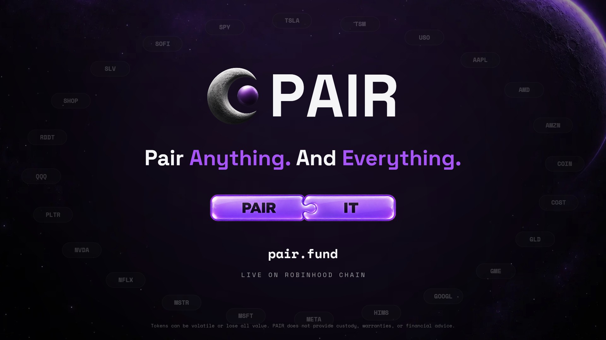

# pair-promo-video

[PAIR](https://pair.fund/) 的 32 秒宣传片，完全用代码生成：一个 Canvas 场景文件逐帧渲染画面，一个合成器脚本生成原创配乐和音效，最后由 ffmpeg 合成 MP4。



**成片：[`out/pair-promo.mp4`](out/pair-promo.mp4)**

| 项目 | 规格 |
| --- | --- |
| 画面 | 1920×1080，60 fps，每帧 4 个子帧做运动模糊（快速镜头处 16 个），H.264 (yuv420p, BT.709) |
| 声音 | 原创合成配乐，120 BPM，D 小调，AAC 256k，响度 -14 LUFS |
| 时长 | 32 秒（16 小节，每小节 2 秒） |

## 做法：参考 awesome-opus5-5-videos

参考仓库 [yihui-dev/awesome-opus5-5-videos](https://github.com/yihui-dev/awesome-opus5-5-videos) 收录了 389 条用 Claude Opus 5.5 写代码生成视频的提示词。这支片子主要借鉴了其中几条产品宣传片提示词的方法：

- **[@verbove](https://x.com/verbove/status/2103483957266268381) / [@AnnaCher___](https://x.com/AnnaCher___/status/2103571096549433425)**：一个 canvas、一个 `draw(t)` 纯函数，不用计时器，不在帧之间保存状态；闭式弹簧（closed-form spring）只允许很小的过冲，多次改变目标的数值用“弹簧求和”保持纯函数；120 BPM 节拍网格，每拍都有事件发生；先渲染每拍一帧的联系表（contact sheet）检查，再出全片；用光标驱动真实的 UI 操作。
- **[@brainextends](https://x.com/brainextends/status/2103801834930606193)**：逐秒时间轴、确定性的 `seek(t)`、子帧运动模糊、音乐和画面对拍、输出前检查接缝和文字重叠。
- **[@HowDevelop](https://x.com/HowDevelop/status/2103840883812733090)**：每个转场都要演示一个产品特性；加入“准确性护栏”，屏幕上的每个数字和说法都来自公开资料。
- **[@moritzkremb](https://x.com/moritzkremb/status/2103066071838466494)**：SaaS 发布片的叙事结构（痛点、产品、特性、数据、行动号召）。

## 分镜（节拍网格）

| 时间 | 小节 | 画面 | 声音 |
| --- | --- | --- | --- |
| 0 至 2s | 1 | “Every token needs a pair.” 句号是一颗紫色球体（取自 PAIR Logo），镜头推进球体 | 前奏铺底，心跳底鼓 |
| 2 至 4s | 2 | 球体变成 $ORBIT 代币，与 ETH 配对，价格线剧烈波动：“Most tokens pair with a gas coin.” | 律动进入 |
| 4 至 6s | 3 | “Stop launching against ETH.” ETH 被划掉，连线断开，ETH 掉落 | Breakdown，军鼓滚奏 |
| 6 至 8s | 4 | 紫色圆形转场。“Start launching against the companies that actually print money.” 背景是股票代码墙 | 全律动，上升音效 |
| 8 至 10s | 5 | PAIR Logo 与字标落版：“Launch tokens paired with tokenized stocks.” | Drop，重击 |
| 10 至 14s | 6 至 7 | 发币界面（官网玻璃卡片风格）：输入 Orbit / $ORBIT，点选 NVDA、TSLA、AAPL、SPY 并分配 40/25/20/15%，每次点击落在拍点上，镜头跟随焦点缩放 | 拨弦琶音，打字、点击音 |
| 14 至 16s | 8 | 点击 Launch token，按钮变成加载圈，打勾，变成代币球体；四个市场同时生成：“One transaction. Four markets.” | 提示音，四连弹出 |
| 16 至 18s | 9 | “No bonding curve. No migration. Liquidity never moves.” | 每行一拍 |
| 18 至 20s | 10 | 池子固定不动，下面的时间轴从 SECOND 1 走到 YEAR 5：“The pool at second one is the pool at year five.” | 每格一个滴答 |
| 20 至 22s | 11 | “Choose where fees go.” 四种手续费策略卡片，高亮框在卡片间伸缩滑动 | 弹出、刷过音效 |
| 22 至 24s | 12 | 钱包签名卡片，光标点 Sign：“Non-custodial. By design.” | 点击，提示音 |
| 24 至 28s | 13 至 14 | 全量数据计数：$127M+ 交易量，827K+ 笔交易，2,800+ 个代币，$890K+ 创作者收益；“Partnered with AWS to scale” | 计数滴答，上升音效 |
| 28 至 32s | 15 至 16 | 股票代币绕成环，收拢成 PAIR Logo 与字标：“Pair Anything. And Everything.” 官网的 “PAIR IT” 拼图从两侧飞入并咬合，pair.fund，底部风险提示 | 重击，咬合音，F add9 和弦收尾 |

## 品牌与事实来源

2026 年 9 月 29 日直接读取 pair.fund 官网、文档（/docs）和数据页（/stats）：

**品牌**
- 颜色取自官网 CSS 暗色主题：背景 `#050505`，文字 `#F5F5F7` / `#98989D` / `#636366`，主色紫 `#A855F7`（高亮 `#B975F9`），红 `#F06455`，绿 `#34D399`。按钮使用官网主按钮的紫色渐变。
- 字体与官网一致：Space Grotesk（正文、标题）与 Space Mono（数字、标签、按钮），均为 SIL OFL 1.1。
- `assets/brand/` 中的 Logo（月牙与紫色球体）、“PAIR IT” 拼图和星空月球背景来自 pair.fund，版权归 PAIR Labs。
- 结尾口号 “Pair Anything. And Everything.” 与底部风险提示均为官网原文。

**产品事实（pair.fund/docs）**
- Robinhood Chain 上的无许可发币平台，发币方式有 V1、Launch V2 和 Infinity（当前默认）。
- 一笔交易原子化地创建代币和 1 至 5 个带权重的配对市场，每个配对资产有自己独立的池子。
- 没有 bonding curve；“毕业”不会迁移流动性，交易一直在原来的池子里进行。
- Launch V2 与 Infinity 的手续费按策略执行：创作者收费、分成给多个钱包、回购销毁、分配给持有者。V1 为固定的 1% 交易费，70% 给创作者，30% 给协议金库。
- 非托管：钱包直接对合约签署每笔交易，PAIR Labs 不持有资金。
- 片中发币界面出现的 24 个代码，都在文档当前启用的股票代币列表中（共 61 个）。

**数据（pair.fund/stats，All time，V1 与 Launch V2 合计）**
- 累计交易量 $127.16M，发币 2.8K 个，交易 827.1K 笔，创作者收益 $890.13K（官网按 交易量 × 1% × 70% 计算）。
- 与 AWS 合作扩展基础设施的说法来自 2026 年 8 月 31 日的新闻稿。

片中的 $ORBIT 是虚构的示例代币，价格曲线和发币界面是示意动画（官网发币页需要连接钱包，无法截取），样式按官网的卡片和按钮重绘。

## 重新渲染

```bash
npm install                 # @napi-rs/canvas
pip install imageio-ffmpeg  # 自带 libx264 的 ffmpeg；也可以设置 FFMPEG=/path/to/ffmpeg

npm run audio               # build/audio.wav（合成配乐 + 音效，响度归一化）
npm run contact             # build/contact-*.png，每拍一帧的联系表
node scripts/render.mjs     # out/pair-promo.mp4（并行渲染，自动混入音轨）
node scripts/render.mjs --still 29.8   # 单帧检查
npm run preview             # 浏览器预览 http://localhost:8080 ，可拖动时间轴
```

渲染参数：`--fps 60 --sub 4 --fast-sub 16 --shutter 0.5 --crf 16 --workers N --from 0 --to 32`。快速镜头的时间窗在 `src/scene.js` 的 `FAST` 里。4 核机器上全片约 4 分钟。

## 文件

```
src/scene.js        场景：draw(ctx, t) 纯函数，所有时间点、文案、品牌色
scripts/render.mjs  帧渲染（@napi-rs/canvas）+ 子帧运动模糊 + ffmpeg 编码
scripts/audio.mjs   配乐与音效合成，读取 scene.js 里的 CUES 对齐到帧
index.html          浏览器实时预览（同一个 scene.js）
assets/fonts/       Space Grotesk / Space Mono（SIL OFL 1.1）
assets/brand/       PAIR 的 Logo、拼图和背景（来自 pair.fund）
out/                成片、海报帧
```
